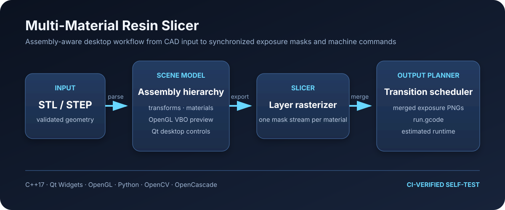

# Multi-Material Resin Slicer

A cross-platform Qt/C++ desktop application for preparing multi-material resin
printing jobs. It imports STL models and STEP assemblies, previews and transforms
parts in OpenGL, assigns materials per model or assembly leaf, exports binary
slice masks, and produces a merged image sequence with machine-oriented G-code.



## Why this project

Conventional resin slicers assume one material for the entire build. This
prototype explores a workflow in which different parts can be assigned to
different resin tanks while preserving assembly transforms and minimizing tank
changes across layers.

The application combines four engineering concerns in one reproducible system:

- interactive 3D model and assembly manipulation;
- robust STL parsing and STEP-to-STL conversion;
- per-material rasterization at printer resolution;
- deterministic scheduling, image merging, and G-code generation.

## Highlights

- Import ASCII or binary STL files with malformed-file, overflow, NaN/Inf, and
  file-size validation.
- Import STEP/STP assemblies through an OpenCascade helper while preserving
  nested assembly paths in the model tree.
- Apply translation, rotation, and scale at either assembly or leaf level.
- Assign individual materials without breaking relative assembly placement.
- Preview models with an OpenGL VBO renderer and configurable build plate.
- Export per-material PNG masks in a background worker with progress,
  cancellation, and a ten-minute backend timeout.
- Plan layer-by-layer tank transitions and generate merged exposure images plus
  `run.gcode`.
- Package the Python image-merging and STEP helpers as standalone executables
  for macOS and Windows.
- Run a headless `--selftest` that exercises model import, raster export,
  configuration generation, image merging, and G-code output.

## Architecture

```text
STL / STEP input
      |
      v
STL parser or OpenCascade converter
      |
      v
Assembly-aware scene model --> Qt/OpenGL preview and editing
      |
      v
Per-material slice exporter
      |
      +--> material_0/1.png, material_1/1.png, ...
      |
      v
Python merge backend --> merged PNG sequence + run.gcode
```

See [the architecture notes](docs/architecture.md) for module boundaries,
failure handling, and design trade-offs.

## Build from source

### Prerequisites

- CMake 3.16+
- A C++17 compiler
- Qt 5.12+ with Widgets and OpenGL
- Python 3.10+
- Python packages from `requirements.txt`

Install the Python backend dependencies in a virtual environment:

```bash
python3 -m venv .venv
source .venv/bin/activate
python -m pip install -r requirements.txt
```

Configure and build the application. Point `CMAKE_PREFIX_PATH` to Qt only when
Qt is not already discoverable by CMake:

```bash
cmake -S . -B build -DCMAKE_BUILD_TYPE=Release
cmake --build build --parallel
```

On macOS with a standalone Qt installation:

```bash
cmake -S . -B build -DCMAKE_PREFIX_PATH="$(qmake -query QT_INSTALL_PREFIX)"
cmake --build build --parallel
```

## Run

From the repository root:

```bash
./build/MultiMaterialSlicer
```

The repository contains generated demo models under `demo_stl/` and an
anonymized two-part STEP example under `demo_step/`.

Run the end-to-end smoke test without interacting with the UI:

```bash
xvfb-run --auto-servernum ./build/MultiMaterialSlicer --selftest \
  demo_stl/multi_A_base_plate.stl \
  demo_stl/multi_B_cross_insert.stl
```

On macOS, omit `xvfb-run` and launch the binary directly.

## Backend-only workflow

The image-merging backend can also run independently:

```bash
python slice_1080p.py --config /path/to/config.yaml --output /path/to/job
```

The configuration identifies one PNG directory per material, printer motion
parameters, exposure settings, and permitted tank-to-tank transitions. The
backend normalizes image dimensions, schedules material changes, writes merged
exposure masks, and generates `run.gcode`.

The STEP converter is optional and requires CadQuery/OCP:

```bash
python -m pip install -r requirements-step.txt
python tools/step_to_stl_parts.py \
  --input demo_step/two-part-assembly.step \
  --output /tmp/mms-step-parts
```

## Verification

GitHub Actions performs the following checks on every push and pull request:

1. Python compilation and unit tests for configuration, image normalization,
   transition planning, and end-to-end G-code generation.
2. CMake configuration and a full Qt/C++ build on Ubuntu.
3. XML validation for the Qt Designer file.
4. An Xvfb-backed application self-test using two STL models.

Run the portable Python checks locally with:

```bash
python -m pip install -r requirements-dev.txt
ruff check slice_1080p.py tools tests
python -m unittest discover -s tests -v
```

## Packaging

Packaging scripts live under `scripts/`:

- `package_macos.sh` builds a native application bundle, packages the helpers,
  runs `macdeployqt`, and creates `dist/MultiMaterialSlicer-mac-<arch>.zip`.
- `package_windows.ps1` builds the helpers, runs `windeployqt`, performs an
  optional self-test, and creates `dist/MultiMaterialSlicer-win64.zip`.

The scripts create isolated virtual environments under the ignored
`backend_build/` directory. Generated applications, helpers, and archives are
never committed to Git.

## Scope and limitations

- This is an engineering prototype, not production printer-control software.
- G-code semantics and machine presets must be validated against the target
  printer before operating hardware.
- The checked-in CI validates STL import. STEP conversion is tested separately
  because CadQuery/OCP substantially increases CI time and image size.
- The interface is currently localized primarily in Simplified Chinese; the
  code and public documentation use English identifiers and descriptions.
- Release binaries are not code-signed with a commercial certificate.

## Repository layout

```text
config/       machine and material presets
demo_step/    anonymized STEP assembly fixture
demo_stl/     generated STL fixtures
docs/         architecture and design notes
resources/    Qt styles and icons
scripts/      macOS and Windows packaging automation
src/          Qt/C++ application
tests/        Python backend regression tests
tools/        demo-model and STEP conversion utilities
ui/           Qt Designer interface
```

## License

The original source code is released under the [MIT License](LICENSE).
Third-party frameworks and optional packaging dependencies retain their own
licenses; see [THIRD_PARTY_NOTICES.md](THIRD_PARTY_NOTICES.md).
